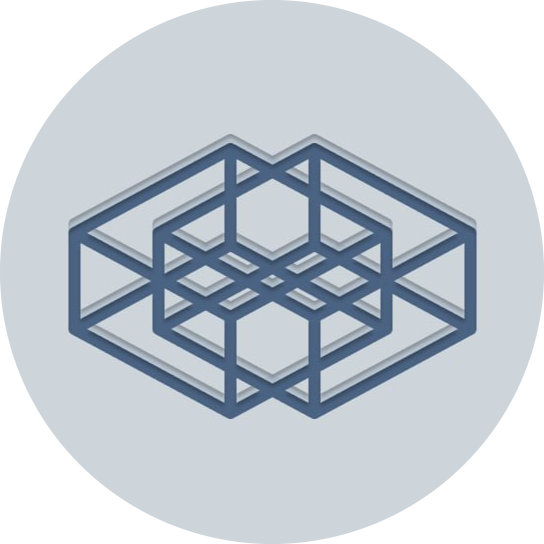
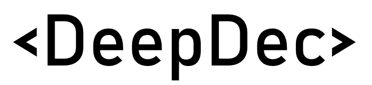

  

# Multi-agent system for end-to-end reverse engineering of decompiled C code

## Description
**DeepDec** is an end-to-end solution for analyzing and reconstructing decompiled C code using LLM (Large Language Models). The system automates the reverse engineering process by providing:
1. **Multi-agent architecture:** Several specialized AI agents (analyst, commentator, reconstructor, aggregator) jointly process the code.
2. **Deep analysis:** Logic recovery, comment generation, vulnerability identification, and code optimization.
3. **Interactive interface:** Visualization of results via GUI with the ability to export reports.
4. **Integration with different APIs:** Support for OpenAI, HuggingFace, and OpenRouter for flexibility in model selection.

The project is designed for:
- Program security analysis.
- Restoring the logic of the legacy code.
- Educational goals in the field of reverse engineering.

## Features
- **Parallel code processing** by agents using `concurrent.futures`.
- **Dynamic assessment** of response quality through a validation system.
- **Realtime monitoring** of execution via a ZeroMQ socket.
- **Configurable APIs:** Support for OpenAI, HuggingFace, and OpenRouter (list can be expanded)
- **Generation of structured reports** in JSON format.
- **OOP architecture** in compliance with SOLID, GoF, GRASP, DDD patterns

## Technologies
**Backend:**
- Python 3.10+
- ZeroMQ (asynchronous communication with frontend)
- APIs: OpenAI API, HuggingFace, OpenRouter
- Multithreading (concurrent.futures)
- ABC, Data Classes (implemention some OOP patterns)
- Logging module
- And others modules: `requests`, `json`, `re`, `time`, `pathlib`, `typing`, `enum`

**Frontend:**
- Python 3.10+
- PyQt5 (GUI)
- ZeroMQ (asynchronous communication with backend)
- Subprocess and Threading (backend launching)
- Stylized interfaces (CSS animations, custom widgets)
- And others modules: `sys`, `os`, `time`, `json`

## Repository Content
- backend/diagrams - UML diagrams for backend (deepdec.py): ER diagram, class diagram, sequence diagram, sequence diagrams for separate blocks
- backend/prompts - prompts for LLM-agents
- backend/deepdec.py - backend module
- backend/tests - unit tests, integration tests, end-to-end tests for deepdec.py
- backend/decompiled_code_examples - big dataset of decompiled programs (decompiler: HexRays)

- frontend/app_project.py - frontend module

- full_project/DeepDec.zip - archive with program
- full_project/diagrams - diagrams of full system

## Installation
1. Install Python (for example version 3.12).
2. Make sure that all Python libraries specified in **Technologies** can be installed without errors.
3. Download `DeepDec.zip` from directory `full_project` and unpack it.

## Usage
**Only backend:**
1. Put in same directory `backend/deepdec.py`, all agents prompts, txt file with decompiled code (you can take `backend/test.txt`) and `backend/config.json` (put your OpenRouter API key or change necessary data to use other APIs).
2. Make sure that all modules specified in **Technologies** are installed.
3. Run program: `python deepdec.py`.
4. When program finishes, report will be stored in `full.json` in same directory.

**Full program:**
1. Follow all the steps from **Installation**
2. Launch `launcher.exe`.
3. In opened window enter LLM API type (`openai`/`huggingface`/`openrouter`), your API key, API URL (e.g. `https://openrouter.ai/api/v1/chat/completions`) and model name (e.g. `deepseek/deepseek-r1-distill-llama-70b:free`). You can get all three latest data on the portal OpenRouter (`https://openrouter.ai/`).
4. Download a txt file with decompiled C code.
5. Start file processing process.
6. Wait for result of processing completion and follow it through messages that appears in empty field.
7. Upload json file with report of analysis, reconstruction of code, code with comments and aggregation of these answers.
8. Go back to the main menu and repeat 4-7 points if necessary.

## Testing
Unit tests, integration tests, end-to-end tests (backend) and manual testing (frontend+backend) were conducted.

## Roadmap
- Large-scale testing of code analysis results using autometrics and a team of expert assessors
- Adding support for other languages (Java, C++) and decompilers (RetDec, Ghidra, IDA Pro).
- Integration with decompilers via plugins.
- Implementation of the cloud processing mode.

## Authors and acknowledgment
The project was developed by students of the National Research Nuclear University MEPhI:
- **Kislov K.A.** - teamlead, backend, testing
- **Sukhonos A.A.** - frontend, testing
- **Klyubin D.A.** - frontend, testing
- **Mutinezhnikova E.S.** - UML diagrams, design
- **Bizyukova D.S.** - UML diagrams, design

## Contacts
kislov_konstantin05@mail.ru

## License
The project is distributed under the MIT license.

## Project status
MVP, improvement will continue after a while.
